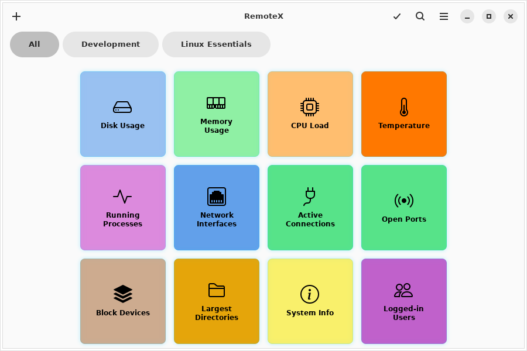

# Appearance

## Per-button colors

Each button has two independent color settings, accessible in the button editor:

- **Color** — background color of the tile
- **Text color** — color of the label

Both use a 40-color GNOME palette with a hex input field for custom values.

## Button size

**Preferences → Button Grid Layout → Button size**

| Size | Dimensions |
|------|-----------|
| Small | 80 × 80 px |
| Medium | 120 × 120 px |
| Large | 160 × 160 px |

## Show icon only / label only

In the button editor:

- **Hide label** — displays the icon only (useful for small buttons or well-known icons)
- **Hide icon** — displays the label only

## Button themes *(Pro)*

!!! tip "Pro feature"
    Button themes require [RemoteX Pro](pro.md).

**Preferences → Button Appearance → Button theme**

| Theme | Style |
|-------|-------|
| Bold | Solid colored tiles with strong contrast (default) |
| Cards | Elevated card style with subtle shadows |
| Phone keys | Compact flat tiles, reminiscent of a dial pad |
| Neon | Dark background with glowing accent borders |
| Retro | Terminal-inspired monochrome with scanlines |

{ width=49% } { width=49% }

### Custom CSS *(Pro)*

Write your own `.css` file targeting `.button-tile` for full control:

```css
.button-tile {
  background: linear-gradient(135deg, #6a0dad, #9b30d9);
  border-radius: 12px;
  border: 2px solid rgba(255,255,255,0.2);
}

.button-tile:hover {
  box-shadow: 0 6px 18px rgba(0,0,0,0.4);
}

.button-tile .tile-label {
  color: #ffffff;
  font-weight: bold;
}
```

Load it via **Preferences → Button Appearance → Custom CSS file → Browse**. Use the **Export template** button to get a starter file with all available selectors and named colors.

## Color scheme

**Preferences → Interface → Color scheme**

- **Follow system** — respects your desktop dark/light setting
- **Light** — always light
- **Dark** — always dark
