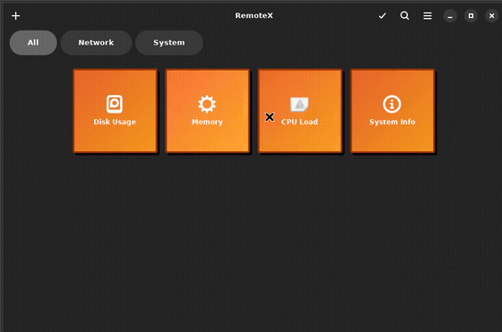

# Bienvenue sur Commandeck

**Commandeck est un lanceur de commandes visuel pour Linux, macOS et Windows.** Créez une grille de boutons cliquables — chacun exécute une commande shell, localement ou sur un serveur distant via SSH.

*▶ Cliquez pour voir la démo*

---

## À qui s'adresse Commandeck ?

**Si vous débutez en ligne de commande**, Commandeck vous évite de mémoriser des commandes. Cliquez sur un bouton pour vérifier l'utilisation de votre disque, mettre à jour votre système ou redémarrer — sans ouvrir de terminal. Commandeck est livré avec des dizaines de boutons prêts à l'emploi.

**Si vous êtes administrateur système ou utilisateur avancé**, Commandeck est un lanceur de commandes SSH visuel. Assignez des boutons à une ou plusieurs machines distantes, exécutez des commandes sur votre infrastructure d'un seul clic, visualisez le résultat instantanément — et pilotez le tout depuis un assistant IA via le [serveur MCP](pro/mcp.fr.md).

---

## Démarrage rapide

1. [Installer Commandeck](installation.md)
2. Lancez l'application — des dizaines de boutons par défaut sont prêts à l'emploi
3. Suivez le [Guide de démarrage rapide](quick-start.md) pour créer votre premier bouton personnalisé

!!! tip "Essayez Pro gratuitement pendant 14 jours"
    La version Pro inclut un [essai automatique de 14 jours](pro.fr.md#essai-gratuit-de-14-jours) — toutes les fonctionnalités déverrouillées, sans carte bancaire, sans email. Téléchargez simplement la version Pro et lancez-la.

---

## Ce qui est inclus

| Fonctionnalité | Disponible dans |
|----------------|----------------|
| Boutons par défaut prêts à l'emploi, organisés par catégorie | Gratuit |
| Exécution locale illimitée | Gratuit |
| Boutons personnalisés | Gratuit (jusqu'à 3) · [Pro](pro.fr.md) (illimité) |
| Catégories, icônes, couleurs, infobulles | Gratuit |
| Machines SSH | [Pro](pro.fr.md) |
| Boutons multi-machines | [Pro](pro.fr.md) |
| Sélection multiple + actions de groupe | [Pro](pro.fr.md) |
| Thèmes de boutons | [Pro](pro.fr.md) |
| Sauvegarde / restauration de la configuration | [Pro](pro.fr.md) |
| Profils d'exécution (run-as-user + mot de passe sudo) | [Pro](pro.fr.md) |
| Serveur MCP (intégration assistant IA) | [Pro](pro.fr.md) |
