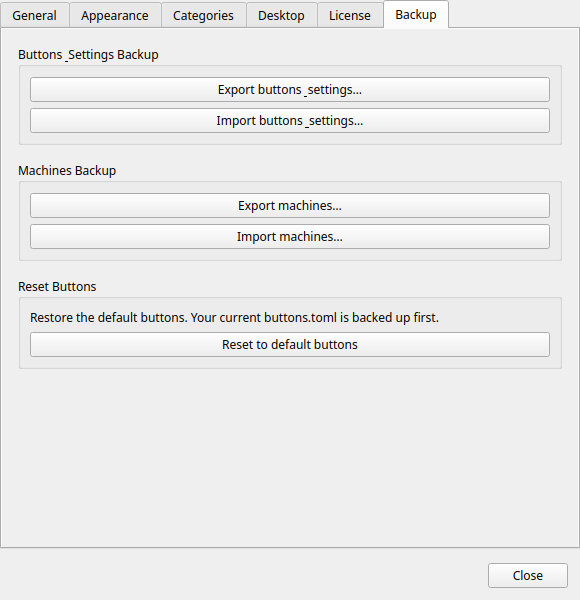

# Backup & Restore

!!! tip "Pro feature"
    Config backup and restore requires [Commandeck Pro](../pro.md).

Commandeck provides two separate export formats, intentionally kept apart for security reasons.

Access both from the **Preferences → Backup** tab.

---

## Buttons & Settings backup — `.cdbackup`

This archive contains:

- `buttons.toml` — all your buttons and their configuration
- `gsettings.json` — all Preferences settings (columns, button size, theme, language, etc.)

### When to use it

- Before a major change (deleting many buttons, reorganising categories)
- When migrating Commandeck to a new computer
- As a periodic snapshot of your button library

### Exporting

Click **Export Buttons & Settings**. A file picker opens. Choose a location and save the `.cdbackup` file.

### Importing

Click **Import Buttons & Settings**. Select a `.cdbackup` file. Commandeck **merges** the imported buttons with your current buttons — it does not wipe your existing configuration first.

!!! note
    Default buttons (Linux Essentials, Development) seeded by Commandeck are never overwritten during import — newly added defaults from a later version are preserved.

---

## Machines backup — `.cdmachines`

This archive contains:

- `machines.toml` — all SSH machine definitions (name, host, user, port, key path, icon)

### What is NOT included

SSH **private keys** are never exported. The archive only stores the path to the key file (`~/.ssh/id_ed25519`), not the key itself.

!!! warning
    The `.cdmachines` file contains hostnames, IP addresses, SSH usernames, and port numbers. Treat it like any network configuration file — do not share it publicly or store it in an unencrypted public location.

### When to use it

- When setting up Commandeck on a second computer (you still need to copy the SSH keys separately)
- As a record of your server infrastructure configuration

### Exporting

Click **Export Machines**. Choose a location and save the `.cdmachines` file.

### Importing

Click **Import Machines**. Select a `.cdmachines` file. Machines are merged with any existing machines. Duplicates (same host + user combination) are skipped.

---

## Restoring on a new computer

Full migration checklist:

1. Install Commandeck on the new machine
2. Copy your SSH private keys to `~/.ssh/` on the new machine (use `scp` or a USB drive — keep them secure)
3. Activate your Pro license in Preferences
4. Import the `.cdbackup` file to restore buttons and settings
5. Import the `.cdmachines` file to restore machine definitions
6. Test each machine connection from **Menu → Manage Machines → (select machine) → Test**
