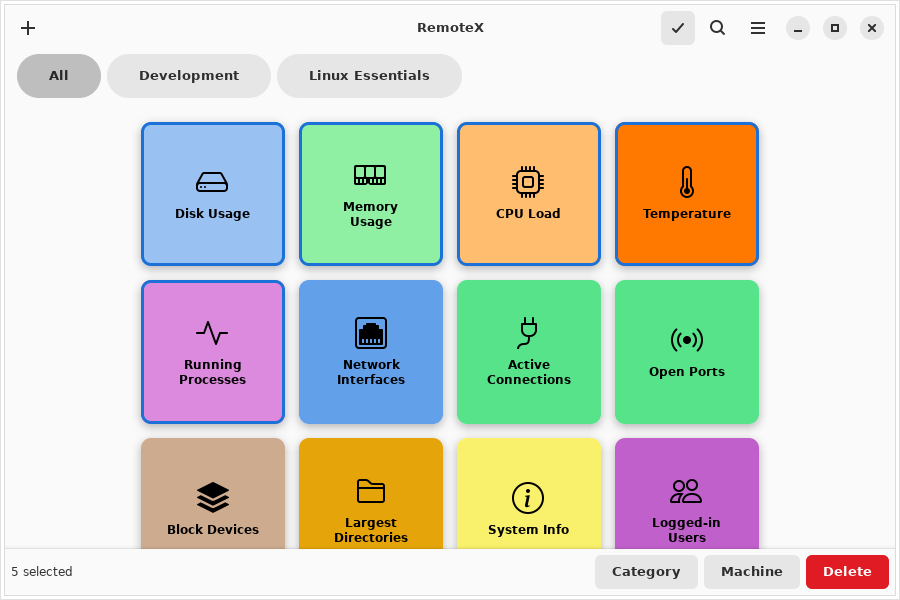

# Sélection multiple

!!! tip "Fonctionnalité Pro"
    La sélection multiple nécessite [RemoteX Pro](../pro.md).

La sélection multiple vous permet d'effectuer des opérations groupées sur plusieurs boutons à la fois — réassigner des catégories, changer de machines ou supprimer un groupe.

---

## Quand utiliser la sélection multiple

- Vous avez migré vers un nouveau serveur et devez réassigner 10 boutons
- Vous souhaitez déplacer tout un ensemble de boutons vers une autre catégorie
- Vous avez créé un lot de boutons temporaires et souhaitez tous les supprimer en même temps
- Vous avez dupliqué plusieurs boutons et devez nettoyer rapidement

---

## Activer le mode de sélection

Cliquez sur l'**icône de sélection** (☑) dans la barre d'en-tête. La grille passe en mode de sélection :

- Cliquer sur un bouton **bascule sa sélection** (mis en surbrillance en bleu) au lieu de l'exécuter
- La barre d'en-tête affiche le nombre de boutons sélectionnés
- Une barre d'actions apparaît en bas de la fenêtre

Appuyez sur `Échap` ou cliquez à nouveau sur l'icône de sélection pour quitter sans appliquer d'action.

---

## Sélectionner des boutons

### Clic pour basculer

Cliquez sur n'importe quelle tuile de bouton pour la sélectionner. Cliquez à nouveau pour la désélectionner. Les tuiles sélectionnées sont mises en surbrillance en bleu.

### Sélection rubber-band

Cliquez et faites glisser sur une **zone vide** de la grille (pas sur un bouton) pour dessiner un rectangle de sélection. Tous les boutons que le rectangle chevauche sont ajoutés à la sélection actuelle.

!!! tip
    Commencez le glissement depuis les marges autour de la grille de boutons — l'espace entre les tuiles ou le rembourrage autour des bords. Commencer directement sur un bouton bascule ce bouton au lieu de dessiner un rectangle.

### Combiner les deux méthodes

Vous pouvez mélanger librement clic et rubber-band. Cliquez d'abord sur des boutons individuels, puis utilisez le rubber-band pour ajouter un groupe, puis cliquez pour désélectionner des boutons spécifiques.

---

## Actions groupées

La barre d'actions en bas affiche les opérations disponibles dès qu'au moins un bouton est sélectionné.

### Supprimer

Supprime définitivement tous les boutons sélectionnés. Une boîte de dialogue de confirmation indique le nombre ("Supprimer 5 boutons ?"). Cette action est irréversible.

Les boutons par défaut (Linux Essentials, Développement) peuvent être supprimés même dans la version gratuite.

### Catégorie

Assigne tous les boutons sélectionnés à une catégorie. Une petite boîte de dialogue demande le nom de la catégorie :

- Saisissez un nouveau nom pour créer une nouvelle catégorie
- Saisissez un nom de catégorie existant pour y déplacer les boutons
- Laissez vide et confirmez pour supprimer l'assignation de catégorie (les boutons deviennent sans catégorie)

### Machine

Assigne tous les boutons sélectionnés à une machine SSH. Un sélecteur liste vos machines configurées ainsi que **Local** :

- Sélectionner une machine → tous les boutons sélectionnés sont mis à jour pour cibler uniquement cette machine (leurs cibles précédentes sont remplacées)
- Sélectionner **Local** → tous les boutons sélectionnés sont configurés pour une exécution locale

!!! note
    L'action **Machine** remplace la cible sur chaque bouton, elle ne l'ajoute pas. Si vous souhaitez des boutons multi-machines, modifiez-les individuellement dans l'éditeur de bouton.

---

## Quitter le mode de sélection

Cliquez sur l'icône de sélection (☑) ou appuyez sur `Échap` pour quitter le mode de sélection. La grille revient à la normale — cliquer sur les boutons exécute à nouveau les commandes.
