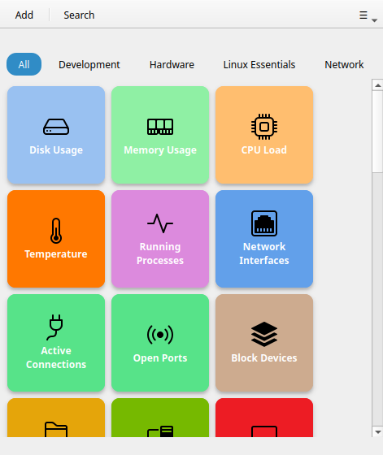
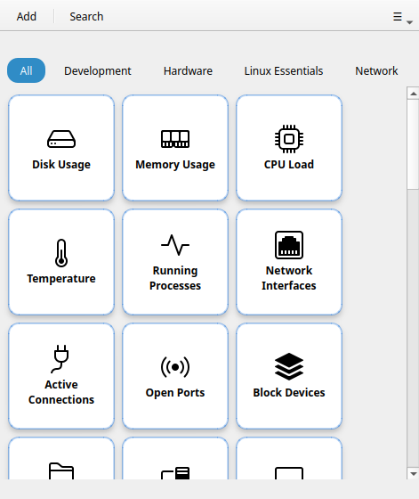
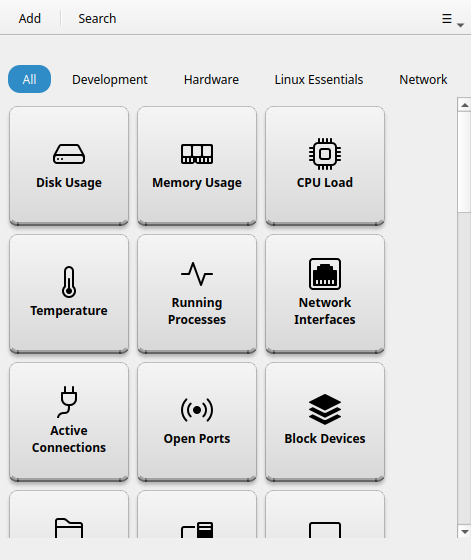
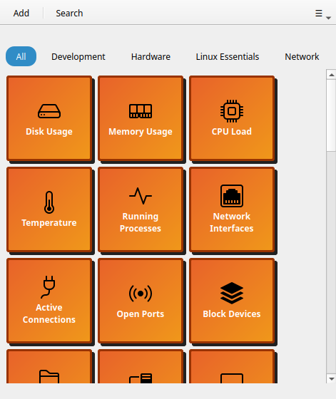

# Thèmes de boutons

!!! tip "Fonctionnalité Pro"
    Les thèmes de boutons nécessitent [RemoteX Pro](../pro.md). La version gratuite est limitée au thème **Gras**.

Les thèmes de boutons modifient le style visuel de toutes les tuiles dans la grille. Sélectionnez un thème depuis **Préférences → Apparence des boutons → Thème des boutons**.

---

## Thèmes disponibles

### Gras (par défaut)

Tuiles colorées pleines avec un fort contraste. C'est le thème système par défaut — les tuiles utilisent le style de carte Adwaita avec la couleur de fond de chaque bouton appliquée en remplissage plat. Fonctionne bien en mode clair et sombre.



### Cards

Style de carte surélevée avec des ombres portées subtiles. Les tuiles semblent légèrement soulevées au-dessus du fond de la grille. Un bon choix si vous préférez une mise en page en couches avec de la profondeur.



### Phone

Tuiles plates compactes avec un rembourrage minimal, évoquant un clavier de téléphone ou de calculatrice. Fonctionne mieux avec une taille de bouton petite ou moyenne et un nombre de colonnes plus élevé.



### Neon

Fond sombre avec des bordures lumineuses qui pulsent au survol. Les couleurs par bouton deviennent la couleur de la lueur. Conçu pour le mode sombre — semble le mieux lorsque votre bureau est en mode sombre.

!!! note
    L'effet lumineux du thème Neon est une animation au survol — il se apprécie mieux en utilisation. Survolez un bouton pour voir la bordure lumineuse.

### Retro

Style monochrome inspiré du terminal avec une texture de lignes de balayage. Force un fond sombre avec du texte vert ou ambre. Ignore les couleurs par bouton — toutes les tuiles se ressemblent intentionnellement.



---

## CSS personnalisé

!!! tip "Fonctionnalité Pro"
    Le CSS personnalisé nécessite [RemoteX Pro](../pro.md).

Pour un contrôle visuel total, chargez votre propre fichier `.css`. Définissez le chemin dans **Préférences → Apparence des boutons → Fichier CSS personnalisé → Parcourir**.

Lorsqu'un fichier CSS personnalisé est chargé, il est appliqué par-dessus le thème sélectionné. Vous pouvez combiner un thème de base avec de petits ajustements CSS, ou écrire un thème complet depuis zéro.

### Cibles CSS disponibles

```css
/* Le conteneur de la tuile */
.button-tile {
  background: #1e1e2e;
  border-radius: 12px;
  border: 2px solid rgba(255, 255, 255, 0.15);
}

/* État de survol */
.button-tile:hover {
  box-shadow: 0 0 16px rgba(137, 180, 250, 0.5);
}

/* État actif / pressé */
.button-tile:active {
  transform: scale(0.97);
}

/* Le texte de l'étiquette */
.button-tile .tile-label {
  color: #cdd6f4;
  font-weight: bold;
  font-size: 0.85rem;
}

/* État en cours d'exécution (commande en cours) */
.button-tile.running {
  opacity: 0.6;
}

/* Flash de succès */
.button-tile.success {
  border-color: #a6e3a1;
}

/* Flash d'échec */
.button-tile.error {
  border-color: #f38ba8;
}
```

Cliquez sur **Exporter le modèle** dans les Préférences pour télécharger un fichier de départ contenant tous les sélecteurs disponibles avec leurs valeurs par défaut en commentaire.

!!! note
    Le CSS GTK4 ne prend pas en charge `max-width` ni `max-height`. Utilisez `halign`/`valign` sur les widgets à la place. Le dimensionnement en pourcentage a également un support limité — les valeurs en pixels sont plus fiables.
