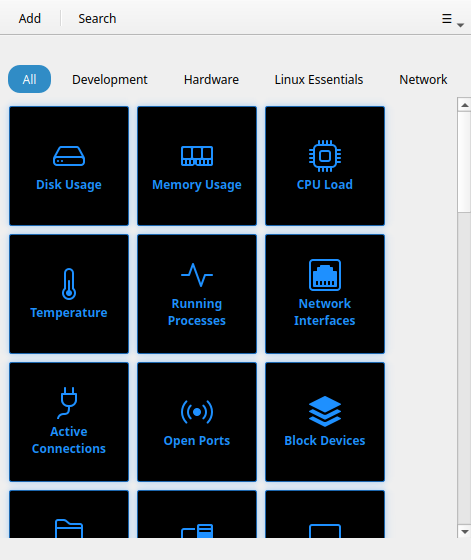

# Button Themes

!!! tip "Pro feature"
    Button themes require [Commandeck Pro](../pro.md). The free tier is locked to the **Bold** theme.

Button themes change the visual style of every tile in the grid. Select a theme from **Preferences → Button Appearance → Button theme**.

---

## Available themes

There are six themes. **Bold** and **Neon** keep each button's own color; **Cards**, **Phone keys**, **Retro** and **Tron** apply a uniform style and ignore per-button colors.

### Bold (default)

Solid colored tiles with strong contrast — your per-button background color as a flat fill with bold white text. The system default; works well in both light and dark mode.


### Cards

Light card-style tiles with a soft accent-tinted border. Clean and neutral — a good choice if the Bold colors feel too strong.


### Phone keys

Compact, rounded keys with a soft shadow, reminiscent of a phone dialer or calculator. Works best with small or medium button size.


### Neon

Your button colors with glowing cyan text and borders that pulse on hover. Dark-mode friendly.


!!! note
    Neon's glow is a hover animation — best appreciated at runtime. Move the mouse over a button to see the border light up.

### Tron

Black tiles with bright cyan outlines and text — a grid-runner look. Ignores per-button colors; every tile shares the same neon-on-black style.



### Retro

Amber monochrome with a hard offset border, terminal-inspired. Ignores per-button colors — all tiles look the same intentionally.


---

## Custom CSS

!!! tip "Pro feature"
    Custom CSS requires [Commandeck Pro](../pro.md).

For full visual control, load your own stylesheet file. Set the path in **Preferences → Button Appearance → Custom CSS file → Browse**. Commandeck uses **Qt Style Sheets (QSS)** — a CSS-like syntax, but with Qt's own selectors and a smaller property set than web CSS.

When a custom stylesheet is loaded, it is applied on top of the selected theme. You can combine a base theme with small overrides, or write a complete theme from scratch.

### Available targets

A button is a `QFrame` named `ButtonTile` containing a `QLabel` named `TileLabel`. Its
states (running, success, error, selected) are exposed as **dynamic properties** you match
with `[property="value"]` selectors:

```css
/* The tile container */
QFrame#ButtonTile {
  background: #1e1e2e;
  border-radius: 12px;
  border: 2px solid rgba(255, 255, 255, 0.15);
}

/* Hover state */
QFrame#ButtonTile:hover {
  border-color: rgba(137, 180, 250, 0.8);
}

/* Pressed state */
QFrame#ButtonTile:pressed {
  background: #181825;
}

/* The label text */
QFrame#ButtonTile QLabel#TileLabel {
  color: #cdd6f4;
  font-weight: bold;
  font-size: 13px;
}

/* Running state (command is executing) */
QFrame#ButtonTile[running="true"] {
  background: #313244;
}

/* Success flash */
QFrame#ButtonTile[success="true"] {
  border-color: #a6e3a1;
}

/* Failure flash */
QFrame#ButtonTile[error="true"] {
  border-color: #f38ba8;
}

/* Selected (multi-select) */
QFrame#ButtonTile[selected="true"] {
  border-color: #89b4fa;
}
```

Click **Export template** in Preferences to download a starter file containing all available selectors with their default values commented out.

!!! note
    Qt Style Sheets are not web CSS: there is **no** `transform`, `box-shadow`, `opacity`
    transition, `rem` unit, or `max-width`/`max-height`. Use solid colors, borders, and
    `border-radius`; size with pixel values.
