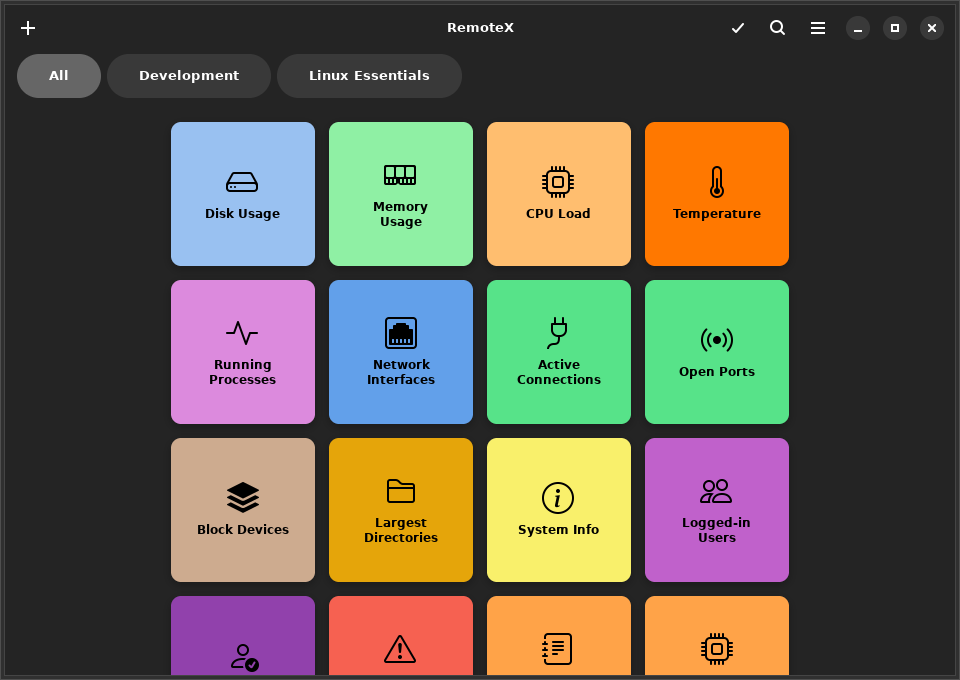

# Démarrage rapide

Lancez RemoteX et créez votre premier bouton en environ deux minutes.

## 1. Lancer RemoteX

Après avoir [installé RemoteX](installation.md), lancez-le depuis le dossier du projet :

```bash
./run_dev.sh
```

Au premier lancement, votre grille est remplie avec **34 boutons par défaut** organisés en deux catégories : Linux Essentials et Développement. Aucune configuration nécessaire — cliquez sur l'un d'eux pour exécuter la commande immédiatement.



## 2. Utiliser un bouton par défaut

Cliquez sur **Utilisation disque** pour voir votre système de fichiers en un coup d'œil. Une notification toast confirme le succès.

Pour les commandes qui produisent une sortie (comme Utilisation disque), le résultat s'affiche automatiquement dans une petite boîte de dialogue.

## 3. Créer votre premier bouton personnalisé

1. Appuyez sur **Ctrl+N** (ou cliquez sur **+** dans la barre d'en-tête)
2. Renseignez le champ **Étiquette** — le texte affiché sur le bouton
3. Renseignez le champ **Commande** — n'importe quelle commande shell, par exemple `ping -c 4 8.8.8.8`
4. Cliquez sur **Enregistrer**

Votre bouton apparaît dans la grille. Cliquez dessus pour exécuter la commande.

!!! tip
    La version gratuite autorise **3 boutons personnalisés**. [RemoteX Pro](pro.md) supprime cette limite.

## 4. Organiser avec des catégories

Dans l'éditeur de bouton, saisissez un nom dans le champ **Catégorie** (par ex. `Réseau`). Un onglet en forme de pastille apparaît dans la barre de catégories sous l'en-tête. Cliquez sur la pastille pour filtrer la grille sur cette catégorie.

## 5. Prochaines étapes

| Ce que vous souhaitez faire | Où chercher |
|-----------------------------|-------------|
| Comprendre chaque champ du bouton | [Éditeur de bouton](reference/button-editor.md) |
| Explorer chaque élément de l'interface | [Fenêtre principale](reference/main-window.md) |
| Connecter un serveur distant | [Machines SSH](reference/ssh-machines.md) |
| Régler les colonnes, la taille, le thème | [Préférences](reference/preferences.md) |
| Voir des exemples concrets | [Cas d'utilisation](use-cases/home-server.md) |
