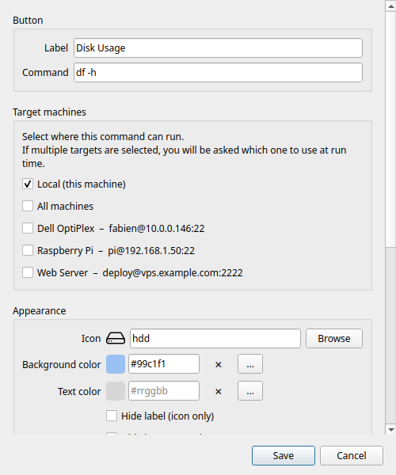

# Éditeur de bouton

L'éditeur de bouton s'ouvre lorsque vous créez un nouveau bouton (**+** / `Ctrl+N`) ou modifiez un bouton existant (clic droit → **Modifier**).



---

## Étiquette

Le texte affiché sur la tuile du bouton dans la grille. Gardez-le court — les étiquettes longues sont tronquées sur les petites tuiles.

---

## Commande

La commande shell à exécuter. Il s'agit d'une ligne de commande bash complète. Exemples :

```bash
df -h                             # résumé de l'utilisation du disque
ping -c 4 8.8.8.8                 # vérification de la connectivité
sudo systemctl restart nginx      # redémarrer un service
git -C ~/monprojet pull           # mettre à jour un dépôt
tar -czf ~/backup.tar.gz ~/docs   # créer une archive
```

Vous pouvez utiliser les fonctionnalités du shell : tubes (`|`), redirections (`>`), substitution de commande (`$()`), et enchaînements (`&&`, `;`).

!!! warning
    Les commandes s'exécutent sous votre utilisateur courant (ou via sudo si vous l'incluez dans la commande). Il n'y a pas de bac à sable — la commande dispose d'un accès complet à votre système de fichiers. N'ajoutez que des commandes en lesquelles vous avez confiance.

---

## Machines cibles

Détermine où la commande s'exécute. La liste affiche **Local** en haut, suivi de toutes vos machines SSH configurées.

**Local** — s'exécute sur votre ordinateur via un sous-processus standard. Aucun SSH requis.

**Machine SSH** — activez une ou plusieurs machines à l'aide de leurs boutons bascule. La commande est exécutée sur chaque machine activée via SSH.

- Si seul **Local** est activé : s'exécute localement, pas de sélecteur.
- Si une seule machine est activée (et Local désactivé) : s'exécute directement sur cette machine, pas de sélecteur.
- Si deux cibles ou plus sont activées : une boîte de dialogue [sélecteur de machine](ssh-machines.md#le-sélecteur-de-machine) s'affiche au moment du clic.

**Toutes les machines** — une option en haut de la liste des machines pour sélectionner/désélectionner toutes les machines en même temps. Utile lorsque vous souhaitez qu'une commande soit disponible partout.

!!! tip "Fonctionnalité Pro"
    L'ajout de machines SSH nécessite [RemoteX Pro](../pro.md). Dans la version gratuite, seul **Local** est disponible.

---

## Apparence

### Icône

Choisissez une icône dans le sélecteur d'icônes intégré. Seules les icônes disponibles et rendables sur votre système sont affichées.

Saisissez dans le champ de recherche pour filtrer par nom. L'icône sélectionnée est prévisualisée sur l'aperçu du bouton en haut de la boîte de dialogue.

Pour supprimer l'icône entièrement, activez **Masquer l'icône** (voir ci-dessous).

### Couleur de fond

La couleur de remplissage de la tuile du bouton. Cliquez sur le champ de couleur pour ouvrir le sélecteur de couleur :

- Une palette GNOME de 40 couleurs pour une sélection rapide
- Un champ de saisie hexadécimale (`#rrggbb`) pour des valeurs précises

Laissez vide pour utiliser la couleur de tuile système par défaut.

### Couleur du texte

La couleur de l'étiquette du bouton. Indépendante de la couleur de fond. Même sélecteur que ci-dessus.

Laissez vide pour utiliser la couleur d'étiquette par défaut (s'adapte automatiquement aux modes clair/sombre).

### Masquer l'étiquette

Lorsque cette option est activée, l'étiquette du bouton est masquée — seule l'icône est affichée. Utile pour les très petites tuiles ou les icônes immédiatement reconnaissables.

### Masquer l'icône

Lorsque cette option est activée, l'icône est masquée — seul le texte de l'étiquette est affiché. Utile lorsqu'aucune icône ne convient ou lorsque l'étiquette seule est suffisamment claire.

---

## Organisation

### Catégorie

Saisissez un nom de catégorie pour assigner ce bouton à un groupe. Les boutons partageant le même nom de catégorie apparaissent sous le même onglet pastille dans la [barre de catégories](main-window.md#barre-de-catégories).

- Les noms sont sensibles à la casse (`Serveur` et `serveur` sont des catégories différentes)
- Laissez vide pour laisser le bouton sans catégorie
- Pour renommer une catégorie, modifiez tous les boutons qu'elle contient et changez le nom de la catégorie

Un clic droit sur un bouton dans la grille propose également **Déplacer vers la catégorie** pour une réassignation rapide.

---

## Comportement

### Infobulle

Texte personnalisé affiché lorsque vous survolez le bouton avec la souris. Si ce champ est vide, l'infobulle affiche par défaut la chaîne de commande.

Utilisez ce champ pour ajouter une description lisible lorsque la commande elle-même n'est pas explicite.

### Confirmer avant d'exécuter

Lorsque cette option est activée, cliquer sur le bouton affiche une boîte de dialogue de confirmation ("Exécuter cette commande ?") avant d'exécuter. Utile pour les commandes destructives comme les redémarrages, arrêts ou suppressions.

La valeur par défaut globale de cette option peut être définie dans **Préférences → Général → Confirmer avant d'exécuter par défaut**.

### Mode d'exécution

Contrôle ce qui se passe après l'exécution de la commande.

| Mode | Comportement |
|------|--------------|
| **Silencieux** | La commande s'exécute en arrière-plan. Un toast indique la réussite ou l'échec. |
| **Afficher la sortie** | Une boîte de dialogue s'ouvre avec le `stdout` / `stderr` complet après la fin de la commande. |
| **Ouvrir dans le terminal** | La commande est lancée dans l'émulateur de terminal système (session interactive complète). |

!!! tip
    **Afficher la sortie** s'ouvre automatiquement en cas d'échec quel que soit le mode sélectionné — vous voyez toujours l'erreur.

    Utilisez **Ouvrir dans le terminal** pour les programmes interactifs : `htop`, `vim`, `python3`, sessions `ssh`, etc.

### Exécuter en tant qu'utilisateur

Actif uniquement lorsque le **Mode d'exécution** est **Ouvrir dans le terminal**. Renseignez ce champ avec un nom d'utilisateur (par ex. `www-data`, `postgres`) pour faire précéder la commande de `sudo -u <utilisateur>`. Utile pour les commandes devant s'exécuter sous un compte de service spécifique.

---

## Enregistrement

Cliquez sur **Enregistrer** pour confirmer. Le bouton apparaît immédiatement dans la grille à la prochaine position disponible.

Pour annuler sans enregistrer, appuyez sur `Échap` ou cliquez en dehors de la boîte de dialogue.
