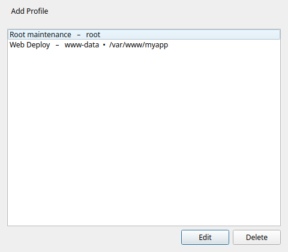
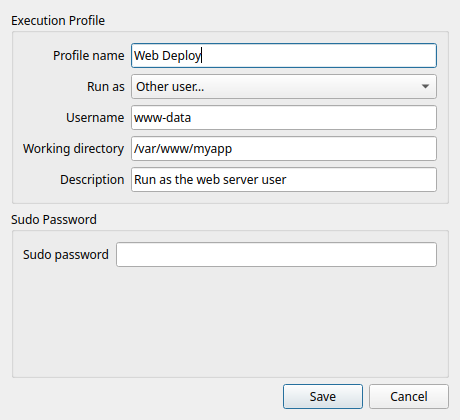

# Profils d'exécution

!!! tip "Fonctionnalité Pro"
    Les profils d'exécution nécessitent [Commandeck Pro](../pro.fr.md).

🔰 **En clair :** un profil est un petit jeu de « conditions d'exécution » que vous enregistrez une fois et réutilisez sur plusieurs boutons — *qui* exécute la commande (un autre utilisateur) et *où* elle s'exécute (un dossier). Plutôt que d'écrire `sudo -u www-data` et `cd /var/www` dans chaque bouton, vous le définissez une fois dans un profil et choisissez ce profil sur le bouton.

## Créer un profil

Ouvrez **Menu ☰ → Profils d'exécution → Ajouter**, puis remplissez :

| Champ | Rôle |
|-------|------|
| **Nom** | Comment le profil apparaît dans le menu déroulant de l'éditeur de bouton. |
| **Exécuter en tant qu'utilisateur** | Exécute la commande sous cet utilisateur au lieu du vôtre (utilise `sudo -u <user>`). Laissez vide pour rester vous-même. |
| **Répertoire de travail** | Le dossier où la commande démarre (comme un `cd` préalable). |
| **Description** | Note facultative pour vous rappeler à quoi sert le profil. |
| **Mot de passe sudo** | Facultatif. Nécessaire seulement si *Exécuter en tant que* demande un mot de passe. Stocké localement, chiffré — voir [Sécurité](security.fr.md). |

## Utiliser un profil sur un bouton

Dans l'[éditeur de bouton](button-editor.fr.md), choisissez votre profil dans la liste **Profil d'exécution**. Le bouton s'exécute alors avec l'utilisateur et le dossier du profil — le champ commande reste propre, ne contenant que la commande réelle.

!!! example "Avant / après"
    Au lieu d'un bouton avec `sudo -u www-data bash -c 'cd /var/www/app && git pull'`, créez :

    - un profil **Déploiement Web** → *Exécuter en tant que* `www-data`, *Répertoire de travail* `/var/www/app`
    - un bouton avec la commande `git pull`, profil **Déploiement Web**

    Plus propre, et le même profil se réutilise pour chaque bouton d'appli web.

⚙️ **Pour les sysadmins**

- *Exécuter en tant que* enveloppe la commande avec `sudo -u <user>`. Si la cible exige un mot de passe, renseignez le **Mot de passe sudo** du profil ; Commandeck le passe via `sudo -S` à l'exécution, sans invite dans un terminal.
- Un profil s'applique de la **même** façon en local et via SSH — l'enveloppe `sudo -u` / répertoire de travail a lieu sur la machine ciblée par le bouton.
- Les profils se marient bien avec les [boutons multi-machines](../use-cases/homelab.fr.md) : un profil « déploiement », un bouton, plusieurs serveurs.
- Un assistant IA peut créer et assigner des profils pour vous via le [serveur MCP](../pro/mcp.fr.md) — il décompose automatiquement une commande shell collée en un profil + une commande propre.
