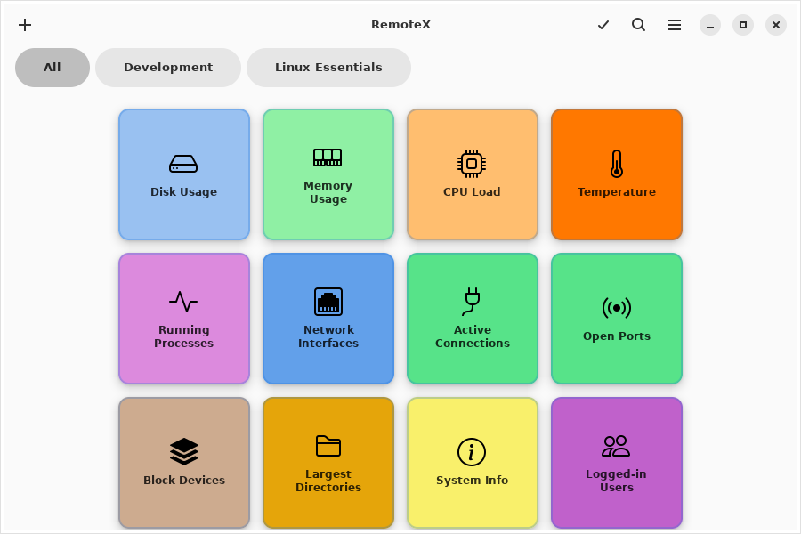
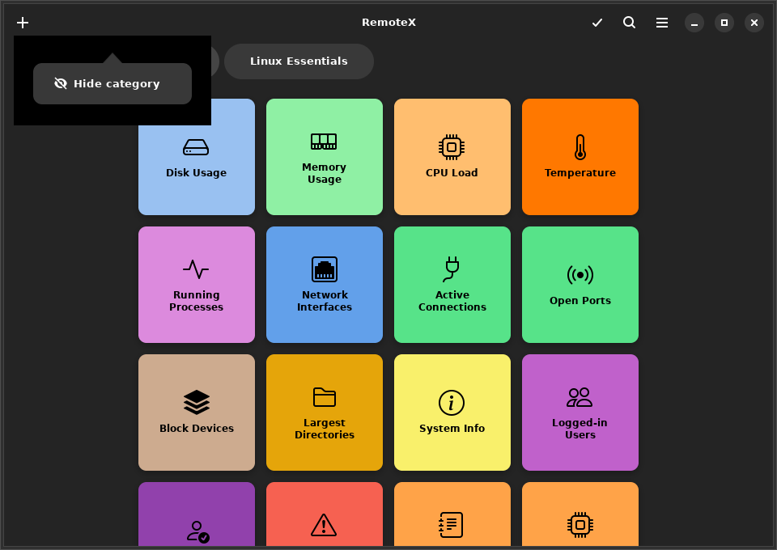
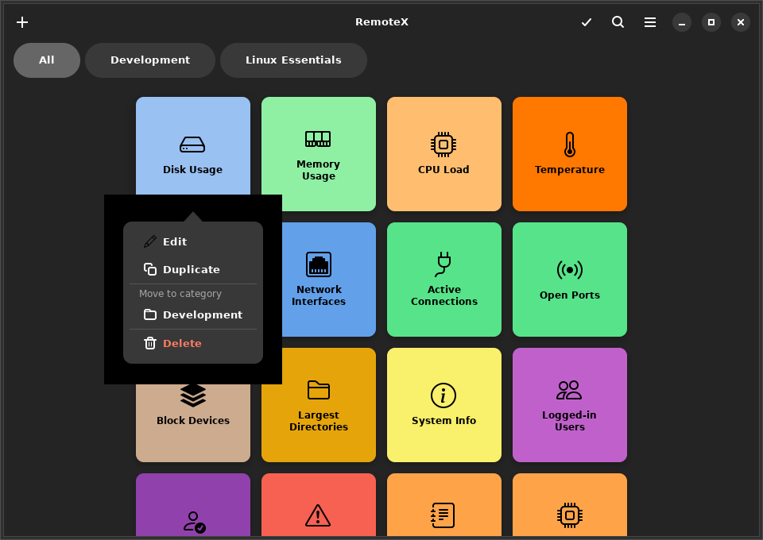

# Main Window

The main window is divided into four zones: the **header bar**, the **category bar**, the **search bar**, and the **button grid**.

---

## Header bar

The header bar is always visible. From left to right:

### + (Add button)

Opens the [Button Editor](button-editor.md) to create a new button. Keyboard shortcut: `Ctrl+N`.

!!! note
    The free tier allows up to 3 custom buttons. The **+** button is greyed out once the limit is reached. [RemoteX Pro](../pro.md) removes this limit.

### Search icon

Toggles the search bar. You can also start typing anywhere in the window to open it automatically.

### Select mode icon (☑)

Enters multi-select mode. In this mode, clicking a button toggles its selection instead of running it. An action bar appears at the bottom for bulk operations.

!!! tip "Pro feature"
    Multi-select requires [RemoteX Pro](../pro.md).

### Hamburger menu (≡)

Opens the application menu:

- **Manage Machines** — opens the machine list dialog (Pro only)
- **Manage Profiles** — opens the execution profile list dialog (Pro only)
- **Always on top** — toggles whether the window floats above all other windows (stateful toggle, checked when active)
- **Preferences** — opens the preferences dialog (`Ctrl+,`)
- **Keyboard shortcuts** — shows all shortcuts (`Ctrl+?`)
- **About RemoteX** — version and license info

---

## Category bar

The category bar appears below the header when at least one button has a category assigned. It is hidden when all buttons are uncategorised.

### All pill

The leftmost pill. Selecting it shows the full grid regardless of categories. It is selected by default.

### Category pills

One pill per category, in the order categories first appear in the grid. Clicking a pill filters the grid to that category only. Only one pill can be active at a time (radio behaviour).

### Right-click on a pill

Right-clicking a category pill opens a small menu:

- **Hide category** — removes the pill and hides all buttons in that category from the grid. The buttons are not deleted.

To reveal a hidden category again, go to **Preferences → Categories** and toggle it back on.

---

## Search bar

The search bar slides in below the category bar when activated. It filters buttons in real time by their label name. The filter applies on top of any active category filter.

Press `Escape` or click the search icon again to close the search bar and clear the filter.

---

## Button grid

The main content area is a scrollable grid of [button tiles](#button-tiles). The number of columns is set in **Preferences → Grid Layout → Buttons per row** and applies live without restarting.

Drag and drop any button to reorder it within the grid.

### Button tiles

Each tile displays:

- An **icon** (top or center, depending on size)
- A **label** (the button name)

The tile background and label color can be customised per button.

**Left-click** a tile to run the command. If the button has **Confirm before running** enabled, a dialog asks for confirmation first. If the button targets multiple machines, a [machine picker](ssh-machines.md#the-machine-picker) appears.

**Right-click** a tile to open the context menu:

- **Edit** — opens the button editor for this button
- **Duplicate** — creates a copy of the button
- **Move to category** — type or pick a category name to reassign
- **Delete** — permanently removes the button (confirmation required)

!!! note
    Default buttons (Linux Essentials, Development) cannot be edited on the free tier. Right-clicking them shows the **Edit** option with a lock icon. [RemoteX Pro](../pro.md) unlocks editing.

---

## Toast notifications

After a command runs, a small toast notification slides up from the bottom of the window:

- **Success toast** — command completed successfully
- **Failure toast** — command failed (exit code non-zero)

For commands with **Show output** mode, or for any command that fails, an output dialog opens automatically with the full `stdout` and `stderr`.

---

## Empty state

If no buttons match the current search or category filter, an empty state illustration is shown with a hint. This is not an error — it just means all buttons are filtered out. Click **All** or clear the search to see your buttons again.

If you have no buttons at all (unusual after a fresh install), the empty state shows a prompt to add your first button.
