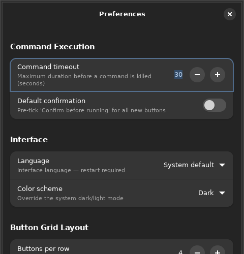

# Preferences

Open Preferences from the hamburger menu or with `Ctrl+,`.

Settings are saved immediately when you change them — there is no Save button.

---

## General



### Language

Selects the interface language. RemoteX supports 12 languages:

| Code | Language |
|------|----------|
| System | Follow your desktop locale (default) |
| en | English |
| fr | French |
| de | German |
| es | Spanish |
| it | Italian |
| pt | Portuguese |
| ru | Russian |
| ko | Korean |
| ja | Japanese |
| zh | Chinese (Simplified) |
| ar | Arabic |
| hi | Hindi |

!!! note
    A language change takes effect after restarting RemoteX. A toast notification reminds you.

### Command timeout

The maximum time (in seconds) to wait for a command to finish before cancelling it. Default: **30 seconds**.

Increase this for commands that are expected to take a long time (large file copies, system updates). Decrease it to fail fast on unreachable machines.

### Buttons per row

The number of columns in the button grid. Range: 1–20. Applied live without restarting.

A value of 4 (the default) works well for medium-sized buttons on a typical 1080p screen.

### Confirm before running by default

When enabled, the **Confirm before running** toggle in the Button Editor is pre-checked for every new button you create.

Does not affect existing buttons.

---

## Button Appearance


### Button size

Sets the size of all button tiles globally.

| Size | Tile dimensions | Icon size |
|------|----------------|-----------|
| Small | 80 × 80 px | 20 px |
| Medium | 120 × 120 px | 32 px |
| Large | 160 × 160 px | 48 px |

### Button theme

!!! tip "Pro feature"
    Button themes require [RemoteX Pro](../pro.md). On the free tier this is locked to **Bold** (system default).

Applies a visual style to all button tiles. See [Themes](../pro/themes.md) for a full description and screenshots of each option.

| Theme | Style |
|-------|-------|
| Bold | Solid colored tiles with strong contrast (default) |
| Phone | Compact flat tiles, reminiscent of a dial pad |
| Neon | Dark background with glowing accent borders |
| Retro | Terminal-inspired monochrome with scanlines |

---

## Desktop Integration


### Always on top

When enabled, the RemoteX window floats above all other windows. Requires `wmctrl`, which is listed as a required dependency (included in the installation instructions). If it is missing from your system:

```bash
sudo apt install wmctrl
```

This setting is also accessible from the hamburger menu as a quick toggle.

### Launch at login

When enabled, RemoteX starts automatically when you log in to your desktop. This writes a `.desktop` file to `~/.config/autostart/remotex.desktop`.

Disabling it removes the autostart file.

### Allow MCP access

Enables the built-in MCP (Model Context Protocol) server. When active, a compatible AI assistant (Claude Desktop, Cursor, etc.) can read and manage your buttons.

Disabled by default. See [AI Integration (MCP)](../mcp.md) for setup instructions.

!!! warning
    When MCP access is enabled, your AI assistant can create, modify, and delete buttons. Disable this toggle when not in use.

---

## Categories


Lists all categories that currently exist in your button configuration. Each row has a toggle:

- **Enabled** — the category pill is visible in the category bar and its buttons appear in the grid
- **Disabled** — the category and its buttons are hidden from the grid (but not deleted)

This is the way to restore a category after hiding it with right-click → **Hide category**.

The list updates automatically as you add or remove categories.

---

## Execution Profiles *(Pro)*

Manage named execution contexts from the hamburger menu → **Manage Profiles** (also accessible from this section). Each profile combines:

- **Profile name** — a short descriptive label (e.g. `As www-data in /var/www`)
- **Run as** — the target user: current user (no sudo), root, or a custom username
- **Working directory** — the directory to `cd` into before running the command
- **Sudo password** — stored locally with machine-specific encoding; passed automatically to `sudo -S` at runtime so no terminal prompt appears

Assign a profile to a button in the [Button Editor](button-editor.md#execution-profile) to apply its settings.

!!! tip "Pro feature"
    Execution profiles require [RemoteX Pro](../pro.md).

---

## License


Manages your RemoteX Pro license.

### Activating

1. Purchase a license at [remotex pro page](../pro.md)
2. Paste your license key in the field
3. Click **Activate Pro**

An internet connection is required for the initial activation.

### Active license display

When a valid license is active, this section shows:

- **License type** — Yearly or Lifetime
- **Expiry date** — for yearly licenses (not shown for lifetime)
- **Status** — Active, or a warning if expiry is within 30 days

### Renewing (yearly license)

Click **Renew license** to revalidate your key after purchasing a renewal. Requires an internet connection.

### Deactivating

Click **Deactivate license** to remove the Pro license from this device. Free tier limits apply immediately.

Your buttons and machines are not deleted — custom buttons beyond 3 are temporarily hidden until you reactivate.
