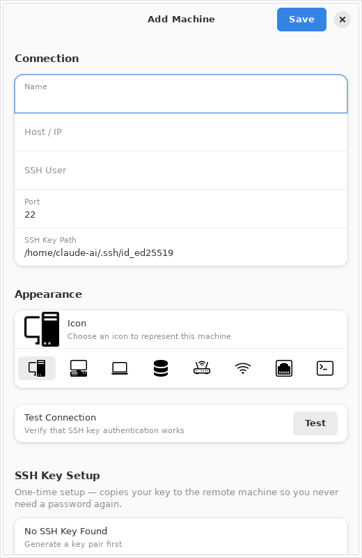
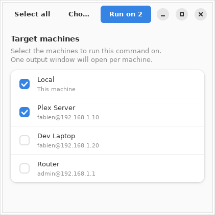

# Machines SSH

!!! tip "Fonctionnalité Pro"
    Les machines SSH nécessitent [RemoteX Pro](../pro.md).

RemoteX se connecte aux serveurs distants via l'authentification par clé SSH. Les mots de passe ne sont jamais stockés.

---

## Gestion des machines

Ouvrez **Menu → Gérer les machines** pour voir la liste complète des machines. Depuis cette fenêtre, vous pouvez ajouter, modifier et supprimer des machines.

!!! note
    L'élément de menu **Gérer les machines** est verrouillé dans la version gratuite.

---

## Boîte de dialogue Ajouter une machine

Cliquez sur **+** dans la boîte de dialogue Machines pour ouvrir le formulaire Ajouter une machine.

### Nom

Un nom d'affichage utilisé uniquement dans RemoteX. Choisissez quelque chose de descriptif — vous verrez ce nom dans les éditeurs de boutons et dans le sélecteur de machine.

Exemples : `Serveur Plex`, `Pi-hole`, `VPS Pro`, `NAS`

### Hôte / IP

L'adresse IP ou le nom d'hôte de la machine distante. Elle doit être accessible depuis votre ordinateur sur le réseau.

Exemples : `192.168.1.50`, `plex.local`, `monserveur.exemple.com`

### Utilisateur SSH

Le nom d'utilisateur pour se connecter sur la machine distante.

Exemples : `pi`, `ubuntu`, `admin`, `votrenom`

### Port

Le port SSH. Par défaut : **22**. Modifiez ce champ uniquement si votre serveur utilise SSH sur un port non standard.

### Chemin de la clé SSH

Le chemin vers le fichier de clé privée utilisé pour l'authentification.

Exemples : `~/.ssh/id_rsa`, `~/.ssh/id_ed25519`, `~/.ssh/cle_monserveur`

Si le champ est vide, RemoteX utilise votre agent SSH ou la clé par défaut (`~/.ssh/id_rsa`).

!!! note
    Les clés avec une phrase de passe nécessitent un `ssh-agent` en cours d'exécution avec la clé chargée. Si la clé est verrouillée, RemoteX affiche un message d'erreur clair — il ne demandera pas la phrase de passe de manière interactive.

### Icône

Une icône visuelle affichée à côté du nom de la machine dans le sélecteur et la liste des machines. Six icônes sont disponibles : bureau, ordinateur portable, serveur, routeur, point d'accès Wi-Fi et un appareil générique.

---

## Configuration des clés SSH

Si vous n'avez pas encore de paire de clés SSH, RemoteX peut en générer une pour vous et copier la clé publique sur le serveur :

1. Cliquez sur **Générer une clé SSH** — RemoteX crée une paire de clés Ed25519 dans `~/.ssh/`
2. Cliquez sur **Copier la clé sur le serveur** — saisissez votre mot de passe une seule fois (il n'est pas stocké). Cela exécute `ssh-copy-id` en interne
3. Les connexions futures utilisent automatiquement la clé, sans mot de passe

---

## Test de la connexion

Cliquez sur **Tester** dans la boîte de dialogue de la machine. RemoteX exécute `echo remotex-ok` sur l'hôte distant. Un message vert confirme que la connexion fonctionne. En cas d'échec, l'erreur complète de SSH est affichée.

Effectuez le test après l'ajout d'une machine et à chaque modification des informations d'identification.

---

## Assigner des machines à un bouton

Dans l'[Éditeur de bouton](button-editor.md), la section **Machines cibles** affiche vos machines sous forme de boutons bascule. Activez les machines souhaitées.

---

## Le sélecteur de machine

Lorsqu'un bouton a deux cibles ou plus activées, un clic dessus ouvre la boîte de dialogue du sélecteur de machine.

Le sélecteur liste chaque cible activée. Sélectionnez-en une et cliquez sur **Exécuter**. La commande s'exécute uniquement sur la machine sélectionnée.

!!! tip
    Si vous souhaitez exécuter sur toutes les machines à la fois sans choisir, vous pouvez le faire en créant des boutons séparés par machine, ou en utilisant la sélection multiple pour les exécuter en séquence.

---

## Modes de sortie via SSH

Les trois modes d'exécution fonctionnent via SSH :

| Mode | Comportement |
|------|--------------|
| **Silencieux** | Le résultat est affiché sous forme de notification toast |
| **Afficher la sortie** | Le `stdout`/`stderr` distant est affiché dans une boîte de dialogue après la fin de la commande |
| **Ouvrir dans le terminal** | RemoteX génère une commande `ssh -t` et l'ouvre dans votre émulateur de terminal — session interactive complète |
