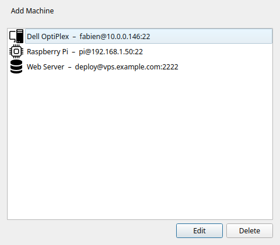

# Cas d'usage : Gérer un parc homelab

!!! tip "Fonctionnalité Pro"
    Les machines SSH, les boutons multi-machines et les profils d'exécution nécessitent [Commandeck Pro](../pro.fr.md).

🔰 **Le but :** vous avez quelques machines à la maison — un NAS, un Raspberry Pi, un petit serveur — et vous retapez sans cesse les mêmes commandes SSH pour les surveiller. Avec Commandeck, vous construisez les boutons une fois et les cliquez depuis une seule fenêtre. Cette page relie les pièces : machines, boutons multi-machines et profils.

## 1. Ajoutez vos machines

**Menu ☰ → Gérer les machines → Ajouter.** Donnez à chacune un nom, un hôte, un utilisateur et une clé SSH.

Au premier contact, Commandeck affiche l'empreinte de l'hôte et vous demande de la confirmer (voir [Sécurité](../reference/security.fr.md)) — pas besoin de pré-remplir `known_hosts` depuis un terminal.

## 2. Un bouton, plusieurs serveurs

Dans l'[éditeur de bouton](../reference/button-editor.fr.md), sous **Machines cibles**, activez plus d'une machine (en incluant éventuellement **Local**). Le bouton devient *multi-machines* : chaque clic ouvre le sélecteur pour choisir où l'exécuter.

!!! example "Bouton de bilan de santé"
    Commande `uptime && df -h`, avec votre NAS, Pi et serveur tous activés. Un seul bouton répond à « comment va chaque machine ? » — choisissez la cible à chaque fois.

## 3. Réutilisez les conditions d'exécution avec des profils

Si plusieurs boutons ont besoin du même compte de service ou répertoire de travail, enregistrez un [profil d'exécution](../reference/execution-profiles.fr.md) une fois et attachez-le — par ex. un profil **Déploiement** (`exécuter en tant que` `www-data`, dossier `/var/www/app`) utilisé par chaque bouton web.

## 4. Organisez par catégorie

Regroupez les boutons en catégories comme *NAS*, *Pi*, *Docker* pour garder la grille lisible. Cliquez un onglet de catégorie pour filtrer.

⚙️ **Pour les sysadmins**

- **Parallèle vs séquentiel :** un bouton multi-machines s'exécute sur **une** machine par clic (via le sélecteur). Pour la même commande sur tous les serveurs d'un coup, cliquez dans le sélecteur pour chaque hôte, ou gardez un bouton par machine dans une catégorie.
- **Parc multi-OS :** aujourd'hui un bouton porte une seule commande. Si une cible tourne sous un OS différent de celui attendu (PowerShell vs bash), elle peut ne pas s'exécuter — gardez pour l'instant des boutons séparés par OS. (Les variantes de commande par OS sont prévues à la feuille de route.)
- **Automatisez avec l'IA :** branchez un modèle local sur Commandeck via [MCP](local-ai.fr.md) et demandez-lui de créer machines, profils et boutons pour tout votre parc d'un coup.
